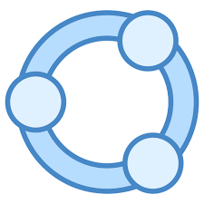
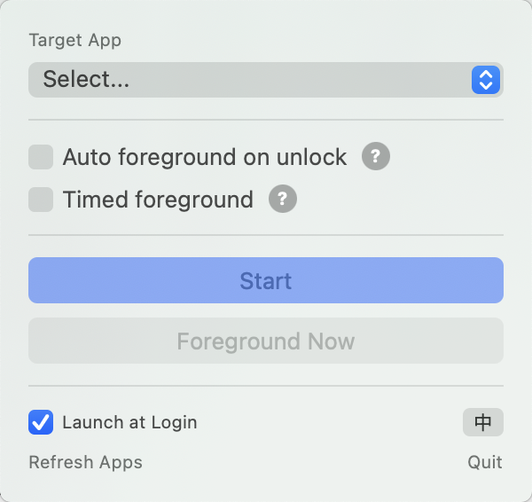

<p align="center">
  
</p>

<h1 align="center">AppForegronder</h1>

<p align="center">
  <b>The app you need, front and center — the moment you unlock.</b><br>
  <sub>解锁即前台。你最需要的那个应用，永远不会让你去找它。</sub>
</p>

<p align="center">
  
  
  
</p>

---

Have you ever unlocked your Mac, only to find yourself hunting for the app you actually wanted?

Every time you open your laptop — browser, chat windows, a random Finder — everything except what you need. You want to check your notes, your terminal, your music player. But it is buried somewhere under a dozen other windows. Again.

It is a small frustration. But it happens dozens of times a day, every single day.

---

每次打开电脑，你最需要的那个应用就是不在最前面。浏览器、聊天窗口、各种随机的窗口……偏偏不是你要的那个。你需要点几下，找几秒，然后才能开始真正的工作。

这件事太小了，小到你不会去抱怨。但它每天发生十几次，日积月累，足以让工作变得更烦躁。

---

**AppForegronder fixes this.** It watches your Mac in the background. The moment you unlock your screen, your chosen app is already waiting at the front — no hunting, no clicking, no context lost. Set it once, and stop thinking about it forever.

**AppForegronder 解决的就是这一件事。** 它在后台默默运行，监视你的屏幕状态。解锁的瞬间，你指定的应用已经在最前面等着你。不需要找，不需要点，不打断你的注意力。配置一次，此后再也不用管它。

---

<p align="center">
  
</p>

---

## What it does / 功能

**Auto-focus on screen unlock** — Opens your app the moment you come back. Every time you unlock, no conditions, no delay.

解锁时自动前置 — 每次解锁都会把目标应用拉到最前面，立刻，无条件。

**Smart lock detection** — Smart enough to know when you have been away long enough to need it. Only fires when the screen was locked past a configurable threshold (e.g., 1 hour), then brings the app front repeatedly to make sure it stays on top.

智能锁屏判断 — 只有当锁屏时长超过你设置的阈值（如 1 小时）才触发，触发后连续前置多次，确保应用真的出现在最前面。

**Timed foreground** — Never lose track of your focus app, even during long uninterrupted sessions. Surfaces your app on a fixed interval you choose (1–60 minutes), independently of lock/unlock.

定时前置 — 按你设定的时间间隔（1 到 60 分钟）循环触发，与锁屏无关。长时间工作也不会把焦点应用搞丢。

**Set it once, forget it forever** — Optionally launch at login. AppForegronder lives quietly in your menu bar and does its job without asking anything from you.

开机自启 — 可以设置开机自动运行。它住在你的菜单栏里，安静地工作，不打扰你。

---

## Get Started / 使用方法

1. Launch AppForegronder — a small icon appears in your **menu bar**
2. Select the app you want to always surface from the dropdown
3. Choose your trigger: on unlock, on a timer, or both
4. Hit **Start**

<!-- -->

1. 启动 AppForegronder，菜单栏出现图标
2. 从下拉菜单选择你想自动前置的应用
3. 选择触发方式：解锁时、定时、或两者都开
4. 点击 **启动**

---

## Installation / 安装

**Build from source:**

```bash
git clone <repo-url> && cd AppForegronder
bash build.sh
cp -r .build/release/AppForegronder.app /Applications/
open /Applications/AppForegronder.app
```

**Download release:**

Download the latest `.app` from [Releases](../../releases) and drag it to `/Applications`.

---

## Permissions / 权限

On first launch, macOS will ask for **Accessibility** access. Grant it at:

**System Settings > Privacy & Security > Accessibility**

This is required to bring other apps to the foreground via macOS automation. AppForegronder does not collect or transmit any data.

首次运行时，macOS 会请求**辅助功能**权限，在以下位置授权：

**系统设置 > 隐私与安全性 > 辅助功能**

---

## Requirements / 系统要求

- macOS 13.0 (Ventura) or later
- Xcode Command Line Tools

> Due to a known CLT toolchain issue, this project uses `swiftc` directly instead of `swift build`. The `build.sh` script handles everything automatically.

---

## License

MIT
